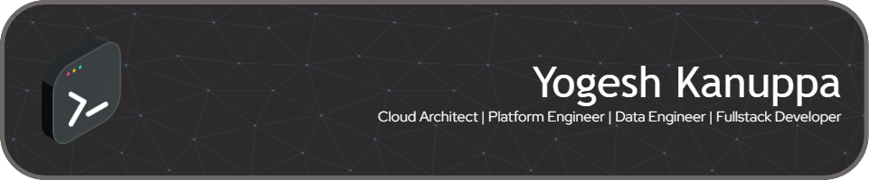

### Hi there 👋
I am a multidisciplinary software engineer, business developer and lifelong learner with 10+ years of industry experience in Cloud Architecture, Platform Engineering, Data Strategy & Engineering and Web / Application Development. Over the years I have designed and developed brands, businesses and built high-performance cost-effective infrastructures and data pipelines.

<!--
**yogeshbabu/yogeshbabu** is a ✨ _special_ ✨ repository because its `README.md` (this file) appears on your GitHub profile.

Here are some ideas to get you started:

- 🔭 I’m currently working on ...
- 🌱 I’m currently learning ...
- 👯 I’m looking to collaborate on ...
- 🤔 I’m looking for help with ...
- 💬 Ask me about ...
- 📫 How to reach me: ...
- 😄 Pronouns: ...
- ⚡ Fun fact: ...
-->
